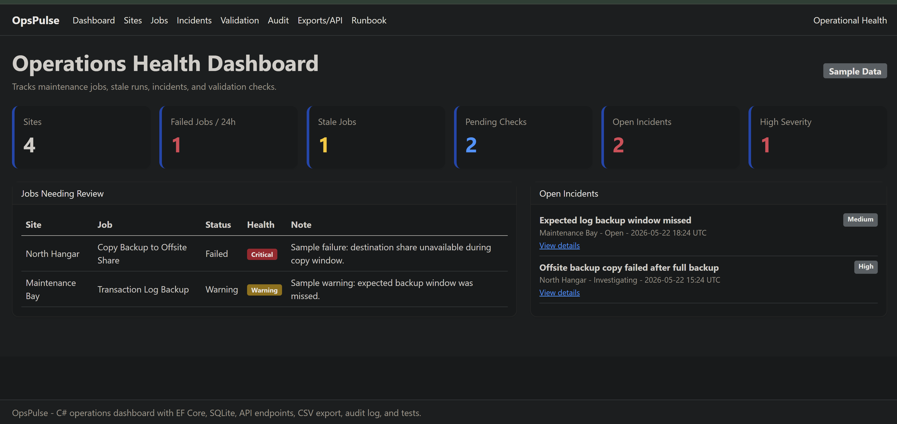
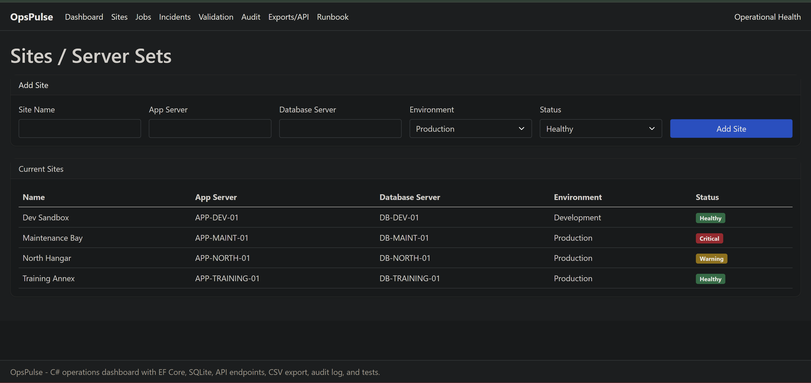
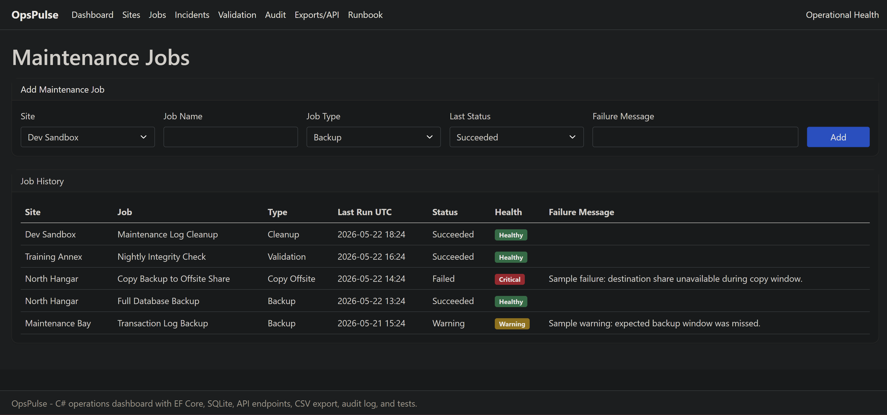
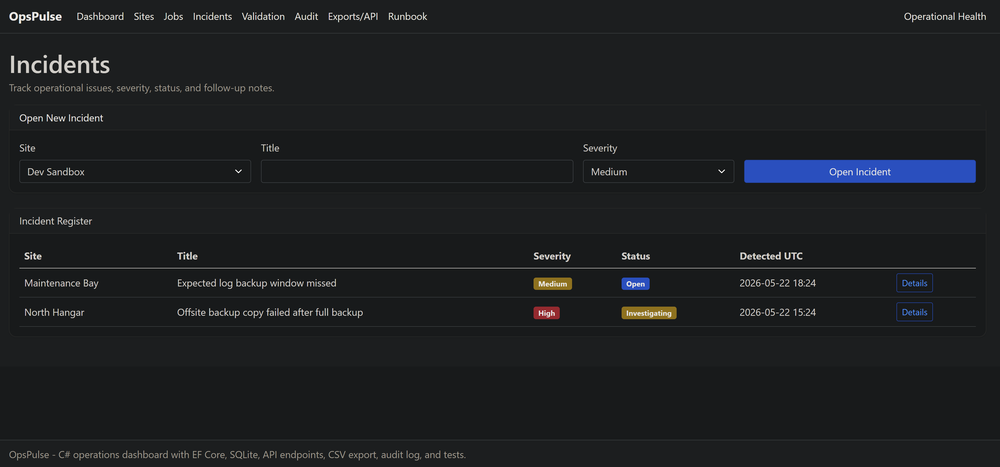
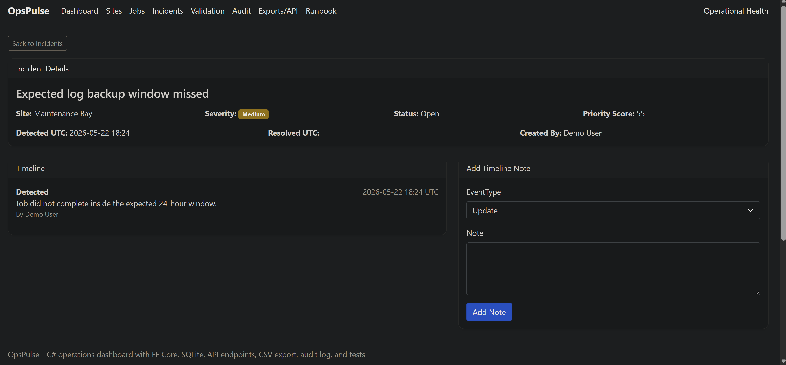
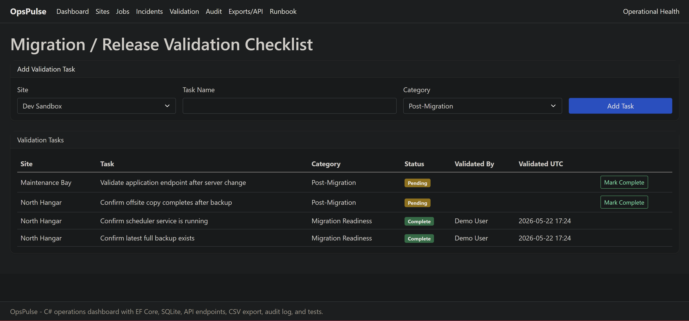
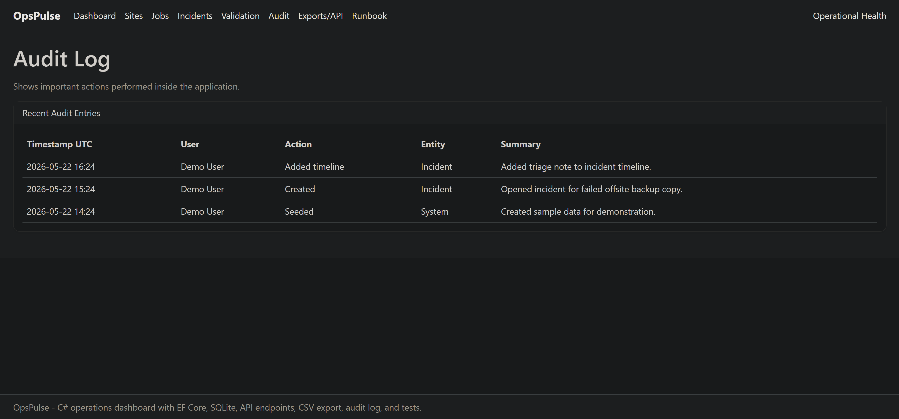
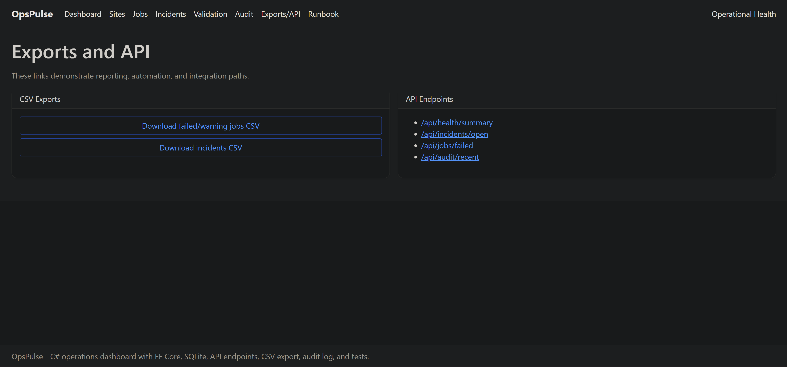

# OpsPulse

OpsPulse is an ASP.NET Core operations dashboard for tracking application support activity across multiple sample sites.

The project is built around a common internal tooling problem: support teams need a quick way to see failed jobs, open incidents, pending validation work, and recent health check results without digging through multiple disconnected sources.

All data in this repository is sample data.

## Features

- Operations dashboard
- Site/server-set tracking
- Maintenance job tracking
- Incident register
- Incident details and timeline notes
- Incident resolution workflow
- Validation checklist
- Audit log
- Synthetic health check results
- CSV exports
- JSON API endpoints
- SQL reporting examples
- Unit tests
- GitHub Actions build/test workflow

## Technology

- C#
- ASP.NET Core Razor Pages
- ASP.NET Core Web API
- Entity Framework Core
- SQLite
- Bootstrap
- xUnit
- GitHub Actions

## Running the project from GitHub

### Prerequisites

Install these first:

- [.NET 8 SDK](https://dotnet.microsoft.com/en-us/download/dotnet/8.0)
- [Git](https://git-scm.com/downloads)

SQL Server is not required. The app uses a local SQLite database and creates it automatically when the app starts.

### Clone with Git

Open PowerShell and run:

```powershell
git clone https://github.com/Trione117/opspulse-operations-dashboard.git
cd opspulse-operations-dashboard
dotnet test
cd src\OpsPulse.Web
dotnet run
```

After `dotnet run` starts, open the localhost URL shown in the terminal.

## API examples

After starting the app, these endpoints can be opened in the browser:

- /api/health/summary
- /api/incidents/open
- /api/jobs/failed
- /api/audit/recent
- /api/export/failed-jobs.csv
- /api/export/incidents.csv

## Screenshots

### Dashboard


### Sites


### Jobs


### Incidents


### Incident Details


### Validation


### Audit Log


### Exports and API


## Repository layout

- src/OpsPulse.Web - web application
- tests/OpsPulse.Tests - unit tests
- docs - project notes and review material
- sql - reporting query examples
- .github/workflows - GitHub Actions build/test workflow

## Notes

This project uses generic sample data only. It does not contain production data, credentials, real logs, internal hostnames, internal IP addresses, or sensitive information.

## Planned improvements

- Add authentication and role-based authorization
- Add edit/delete actions for more records
- Add a SQL Server provider option
- Add import workflow for job history
- Add real endpoint health checks
- Add deployment documentation
